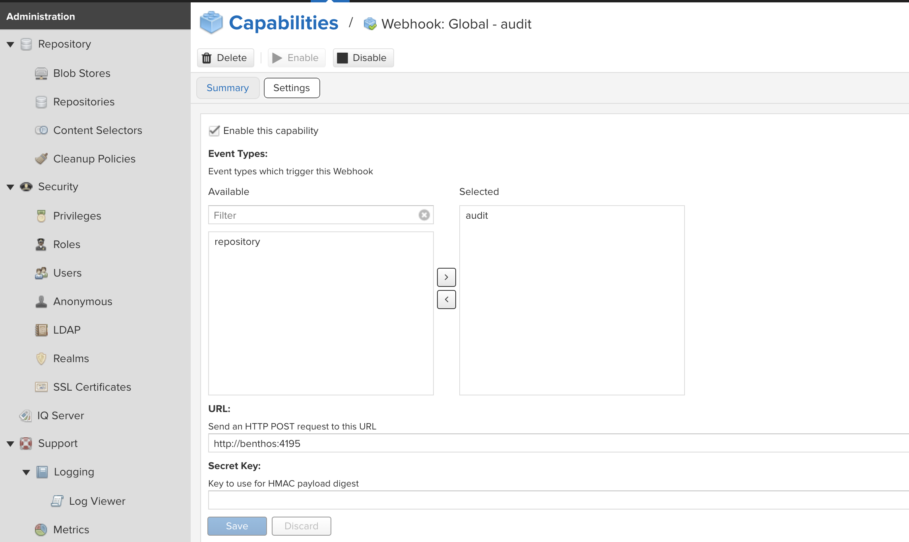
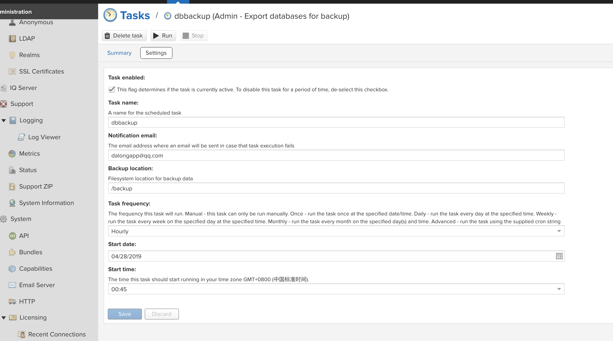

# nexus dbbackup with webhook

use benthos for webhook

## how to config

* add webhook capabilities

> type with audit



* config db exporter



* do some db exporter

click the run button

* some message

```code
 get email message: {"nodeId":"96F7F66A-20527F6B-BB8166EC-C9856291-FEAC65E0","initiator":"*TASK","audit":{"domain":"tasks","type":"started","context":"Admin - Export databases for backup","attributes":{"schedule":"Hourly{properties={schedule.startAt=2019-04-27T16:45:00.000Z, schedule.type=hourly}}","currentState":"CurrentStateImpl{state=RUNNING, nextRun=Sun Apr 28 07:45:00 UTC 2019, future=org.sonatype.nexus.quartz.internal.task.QuartzTaskFuture@74e6c97e}","lastRunState":"LastRunStateImpl{endState=OK, runStarted=Sun Apr 28 06:45:00 UTC 2019, runDuration=545}",".name":"dbbackup","lastRunState.runStarted":"1556433900003",".id":"89fe73e9-0e84-4fdc-8bd1-a29218ca1b50",".typeName":"Admin - Export databases for backup",".visible":"true",".typeId":"db.backup","lastRunState.endState":"OK",".updated":"2019-04-28T06:23:42.575Z",".recoverable":"false",".enabled":"true",".alertEmail":"dalongapp@qq.com",".message":"Admin - Export databases for backup","limitnode":"","lastRunState.runDuration":"545","location":"/backup",".created":"2019-04-28T06:23:42.575Z"}}}
benthos_1    | get email message: {"nodeId":"96F7F66A-20527F6B-BB8166EC-C9856291-FEAC65E0","initiator":"*TASK","audit":{"domain":"tasks","type":"finished","context":"Admin - Export databases for backup","attributes":{"schedule":"Hourly{properties={schedule.startAt=2019-04-27T16:45:00.000Z, schedule.type=hourly}}","currentState":"CurrentStateImpl{state=WAITING, nextRun=Sun Apr 28 07:45:00 UTC 2019, future=null}","lastRunState":"LastRunStateImpl{endState=OK, runStarted=Sun Apr 28 06:56:11 UTC 2019, runDuration=560}",".name":"dbbackup","lastRunState.runStarted":"1556434571288",".id":"89fe73e9-0e84-4fdc-8bd1-a29218ca1b50",".typeName":"Admin - Export databases for backup",".visible":"true",".typeId":"db.backup","lastRunState.endState":"OK",".updated":"2019-04-28T06:23:42.575Z",".recoverable":"false",".enabled":"true",".alertEmail":"dalongapp@qq.com",".message":"Admin - Export databases for backup","limitnode":"","lastRunState.runDuration":"560","location":"/backup",".created":"2019-04-28T06:23:42.575Z"}}}
```